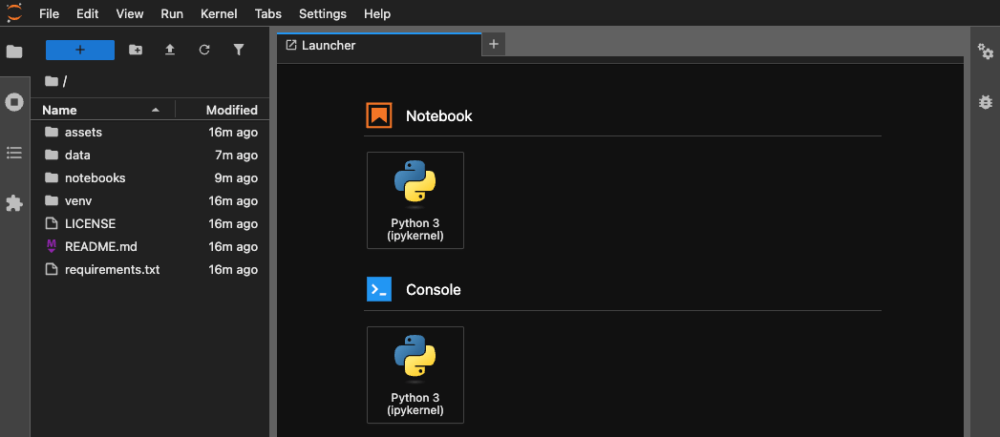
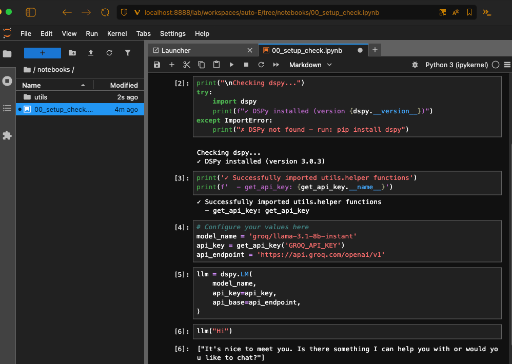

# From Prompts to Programs in 120 Minutes (DSPy Workshop)

PyCon Ireland 2025

## What You'll Learn

* What DSPy is and its building blocks
* How to structure your prompts as Python code
* How to build multi-step pipelines
* How to evaluate and optimize your LLM applications

Groq provides free-tier access. We will be using the `Llama 3.1 8B` model and the `GPT OSS 20B` model for the workshop.

## Prerequisites

* Python 3.12+
* Git

## Quick Start

### Clone and Setup

1. Install `uv`, a fast Python package and project manager.

   [uv installation page](https://docs.astral.sh/uv/getting-started/installation/)

2. Download the project repository:

   ```bash
   git clone https://github.com/Pencroff/dspy_workshop.git
   ```

3. Enter the workshop directory:

   ```bash
   cd dspy_workshop
   ```

4. Create a virtual environment and install dependencies:

   ```bash
   uv venv --python 3.12 venv
   ```

   and activate it:

   ```bash
   source venv/bin/activate  # On Windows: venv\Scripts\activate
   ```

5. Install dependencies:

   ```bash
   uv pip install -r requirements.txt
   ```

### Register on Groq

1. Open [Groq](https://console.groq.com/home) and register for a free account.
2. Open the [API Keys](https://console.groq.com/keys) page.

   

3. Click the `Create API Key` button and save your API key.
4. In the pop-up, enter the key name: `dspy_workshop` and click the `Submit` button.

   

5. Copy your API key and save it in a `.env` file.

   

   The `.env` file should look like this:

   ```dotenv
   GROQ_API_KEY=gsk_YXEdbRF7...   # your_api_key
   ```

### Run Jupyter Notebooks

From the workshop directory `dspy_workshop`, run:

   ```bash
   ./venv/bin/jupyter lab
   ```

This will open JupyterLab in your browser.

   

### Validate Setup

Open the `notebooks/00_setup_check.ipynb` notebook and run all cells.

   

### Run MLflow

Open a separate terminal and run the MLflow server.

Activate the virtual environment:

   ```bash
   source venv/bin/activate
   ```

Run the MLflow server:

   ```bash
   ./venv/bin/mlflow server --backend-store-uri sqlite:///data/mlflow.db --port 5005
   ```


Check the MLflow UI at http://localhost:5005/ or http://127.0.0.1:5005/.

We will use it for the evaluation and optimization notebooks.

   

## Agenda

1. Welcome & Framing - 15 mins (`notebooks/00_setup_check.ipynb`)
2. Setup & First LLM Call - 15 mins (`notebooks/01_first_call.ipynb`)
3. Core Concepts - 15 mins (`notebooks/02_core_concepts.ipynb`)
4. Multi-step Pipeline - 15 mins (`notebooks/03_pipeline.ipynb`)
5. Break - 5 mins
6. Evaluation & Metrics - 20 mins (`notebooks/04_evaluation.ipynb`)
7. Optimization Demo - 20 mins (`notebooks/05_optimization_demo.ipynb`)
8. Wrap-up - 5 mins

## Dataset

Twenty synthetic examples of Python snippets with syntax errors and possible logical issues.

Structure of each dataset element:

   ```yaml
     id: number
     name: short description
     comment: context of the example and issue
     traceback: traceback of the error, usually syntax error
     content: snippet of the code
     test_case: assert test case, verifies the correctness of the code
   ```

## API Providers

Below are a few providers that have a free tier (might not be the best for optimization):

* [Groq](https://console.groq.com/docs/rate-limits)
* [OpenRouter](https://openrouter.ai)
  * Filter for `:free` models in their model list
* [Google AI Studio](https://aistudio.google.com/api-keys)
* And many others...

The optimization process might face ratelimits.

## References

* Paper: [Syntax and Stack Overflow: A methodology for extracting a corpus of syntax errors and fixes](https://arxiv.org/abs/1907.07803)
* Original dataset: [Python3_6_Natural_Syntax_Errors_and_Corrections](https://figshare.com/articles/dataset/Python3_6_Natural_Syntax_Errors_and_Corrections/8244686/1)
* Dataframe: [pandas](https://pandas.pydata.org)
* LiteLLM: [litellm](https://docs.litellm.ai/docs/)
* MLflow: [mlflow](https://mlflow.org)
* [Evaluating and Optimizing LLM Applications with DSPy](https://pedramnavid.com/blog/dspy-evals/)
* [MAGIC of DSPY 3](https://www.youtube.com/watch?v=1067jj67toY)
* [DSPy Tutorial | Build AI Agents with Python](https://www.youtube.com/watch?v=fXjCleTYUm8)
* [The Evaluator–Optimizer Pattern in DSPy with GEPA](https://www.youtube.com/watch?v=gstt7E65FRM)


